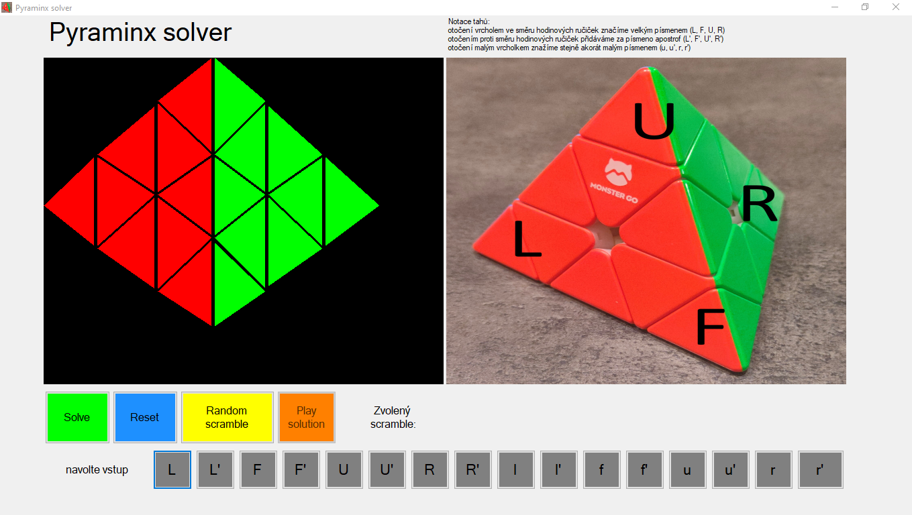

# Pyraminx Solver

A Windows Forms application in C# that finds the **shortest possible** solution to a
scrambled Pyraminx (the tetrahedral cousin of the Rubik's Cube) and walks the user
through it move by move.

Written in 2023 as my final-year project at Gymnázium Christiana Dopplera, Prague.
The accompanying written thesis (in Czech) is in [`docs/`](docs/).



## The problem

A Pyraminx has 14 pieces: 6 edges, 4 vertices and 4 tips. It can be turned 16 ways,
but 8 of those only rotate the little tips and don't move anything else — so the
actual search needs only 8 moves, and the tips get fixed up at the end.

The goal is not just *a* solution but the **shortest** one, which makes this a
shortest-path search over the puzzle's state graph.

## How it works

**State representation.** Rather than storing 36 stickers, the puzzle is kept as two
small arrays: the *orientation* of the 8 vertices and tips (their position never
changes, so position isn't stored at all), and the *position* of the 12 half-edges.
Edges are split into half-edges because a Pyraminx edge has no well-defined
orientation on its own. Total state: two `sbyte` arrays of length 8 and 12.

**Search: iterative deepening.** Breadth-first search would find the shortest
solution but has to hold an entire frontier in memory — by depth 6 that is already
millions of nodes. Plain depth-first search is memory-cheap but gives no guarantee
of optimality. So the solver runs a depth-limited DFS repeatedly with limits
0, 1, 2, …: memory stays proportional to depth, and the first solution found is
guaranteed to be the shortest.

**Pruning.** After turning a given vertex, turning that same vertex again is never
useful — two turns of the same axis either collapse into a single move or undo each
other — so those branches are cut. This drops the branching factor from 8 to 6 after
the first move.

**Tips last.** The 4 tips are independent of everything else, so they are left out of
the search entirely and solved directly at the end. That keeps the state space small
enough for plain iterative deepening to be sufficient.

A typical solve explores on the order of a million nodes at roughly 600k nodes/s.
The worst case is 11 moves, and only 32 scrambles in total are that hard.

**Rendering.** WinForms cannot make triangular controls, and controls are not allowed
to overlap either, so the puzzle is drawn with `Graphics.DrawPolygon` straight onto a
PictureBox: 18 triangles covering two visible faces of the tetrahedron, 54 vertex
coordinates worked out in GeoGebra and stored as percentages of the box size so the
drawing scales with the window.

## Why Pyraminx and not a 3×3×3 cube

The project started as a Rubik's Cube solver. It didn't work — and the interesting
part is *why*. With a branching factor of about 13.5, the search tree grows like this:

| Depth | Nodes (3×3×3) | Nodes (Pyraminx) |
|------:|--------------:|-----------------:|
| 5 | 597,871 | 10,368 |
| 8 | 1,470,987,169 | 2,239,488 |
| 11 | 3,619,180,056,351 | 483,729,408 |
| 20 | 5.4 × 10²² | — (11 is the worst case) |

God's Number for the 3×3×3 is 20, so a brute-force search would have to reach a depth
containing more nodes than there are grains of sand on Earth. My cube version never
got past depth 6 in reasonable time.

The real fix is Korf's IDA\* with pattern databases — precomputed tables of minimum
distance-to-solved that let you prune whole subtrees. I read the papers, decided that
building and managing databases with tens of millions of entries was more than I
wanted to take on at the time, and moved instead to a puzzle where the honest
approach actually works. The thesis in `docs/` covers IDA\* and Thistlethwaite's
algorithm in more detail.

Scaling the problem down until the method fits it — and being able to say precisely
why the original approach fails — was the more useful lesson than forcing it.

## Running it

Open `Pyraminx solver.sln` in Visual Studio (2022 or newer, with the **.NET desktop
development** workload) and press F5. The project targets .NET Framework 4.7.2 and
needs no packages or external dependencies.

Then: **Random scramble** — or click the move buttons to enter your own scramble —
then **Solve**, then **Play solution** to step through the moves.

## Repository layout

```
pyraminx-solver/
├── Form1.cs                  <- solver (Pyraminx, Node, HalfEdge, Tip) + UI event handlers
├── Form1.Designer.cs         <- generated WinForms layout
├── Program.cs                <- entry point
├── Properties/               <- assembly info, resource definitions
├── Resources/                <- hint photos, one per move
├── docs/                     <- written thesis (PDF) and presentation, both in Czech
└── screenshots/
```

## Known limitations

These are real, and I would do them differently now. Documenting them beats quietly
patching them:

- **The solver and the UI live in one file.** `Form1.cs` holds both the search logic
  and the button handlers. The puzzle classes have no WinForms dependency and would
  separate cleanly into their own file; they just never were.
- **Move dispatch is a 16-case `switch`, repeated in four places.** A move table or an
  enum would collapse all of them into one.
- **Playback blocks the UI thread** (`Task.Delay(3500).Wait()`), so the window is
  frozen while a solution plays. `async`/`await` is the fix.
- **The rendering is 2D and shows only two of the four faces.** Enough to check a
  solve against a physical puzzle, but not a real visualization.
- **Comments and identifiers are in Czech**, mixed with English names.

Three genuine bugs found on revisiting this in 2026 *were* fixed, since they made the
program wrong rather than merely inelegant, and all three are marked `// FIX:` in
`Form1.cs`:

- the moves array held 15 entries but could be written up to index 16 on
  maximum-length solutions, overflowing;
- the search loop ran `x < 11` and so stopped one level short of the 11-move worst
  case — those 32 scrambles would silently finish with no solution;
- the random scramble used `rnd.Next(0, 15)`, whose upper bound is exclusive, so the
  move `r'` could never be generated.

The rendering also computed triangle coordinates with integer division
(`Width / 100 * x`), which truncated and left visible gaps between the triangles;
it now rounds properly and enables antialiasing. The layout is otherwise unchanged.

## License

MIT — see [LICENSE](LICENSE).
